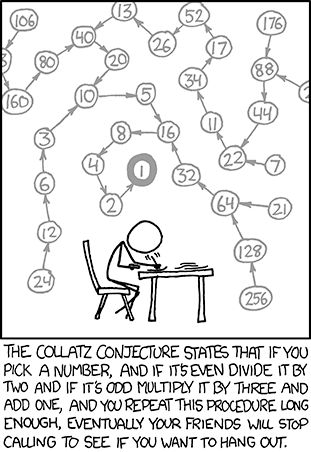

## Getting Started

Welcome to the VS Code Java world. Here is a guideline to help you get started to write Java code in Visual Studio Code.

## Folder Structure

The workspace contains two folders by default, where:

- `src`: the folder to maintain sources
- `lib`: the folder to maintain dependencies

Meanwhile, the compiled output files will be generated in the `bin` folder by default.

> If you want to customize the folder structure, open `.vscode/settings.json` and update the related settings there.

## Dependency Management

The `JAVA PROJECTS` view allows you to manage your dependencies. More details can be found [here](https://github.com/microsoft/vscode-java-dependency#manage-dependencies).

# Exam
## Collatz Conjecture
from (XKCD #710)[https://xkcd.com/710/]



จงเขียน recursive function ที่รับค่า n เป็นจำนวนเต็มบวก และ return ค่าที่รับเข้าทั้งหมด

โดยนิยาม recursive function ว่า
$$f(n) = \begin{cases} 1 & n <= 4  \\ f(n + 1) & \text{if } n \text{ is even} \\ f(n - 4) & \text{if } n \text{ is odd} \end{cases}$$


```
recurB(5)
3
1
```

```
recurB(10)

```