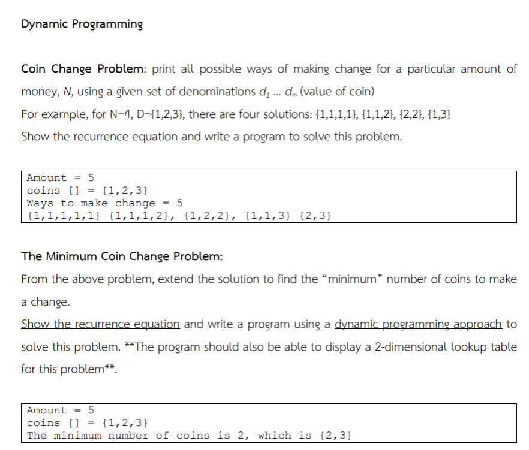

## Recurring Equation

Coin change problem can be formulated as follows:
Where:

- `n` is the target amount
- `D` is the set of denominations
  $$
  f(n, D) = \sum_{d \in D} f(n - d, D)
  $$
  With the base case:
  $$
  f(0, D) = 1
  $$
  $$
  f(n < 0, D) = 0
  $$
  For minimum coin change, we can formulate it as follows:
  Where:
- `n` is the target amount
- `D` is the set of denominations
  $$
  g(n, D) = \min_{d \in D} (1 + g(n - d, D))
  $$
  With the base case:
  $$
  g(0, D) = 0
  $$
  $$
  g(n < 0, D) = \infty
  $$

## Tasks

1. Implement the `coinChange` function to calculate the number of ways to make change for a given amount using the provided denominations. Use memoization to optimize the performance.
2. Implement the `minimumCoinChange` function to find the minimum number of coins needed to make change for a given amount using the provided denominations. Use memoization to optimize the performance.
3. Add console logs to trace the recursive calls and show when a result is retrieved from memory.
4. Test the functions with different amounts and denominations to ensure they work correctly.
5. Analyze the time and space complexity of both functions.

## Example

```ts
const denominations = [1, 5, 10, 25];
const amount = 12;
const result = coinChange(amount, denominations);
console.log(formatResult(result));
// Output:
// { amount: 12,
//   denominations: [1, 5, 10, 25],
//   ways: 4,
//   waysList: [ [1,1,1,1,1,1,1,1,1,1,1,1],
//               [1,1,1,1,1,1,5],
//               [1,1,5,5],
//               [1,1,10] ] }
```
