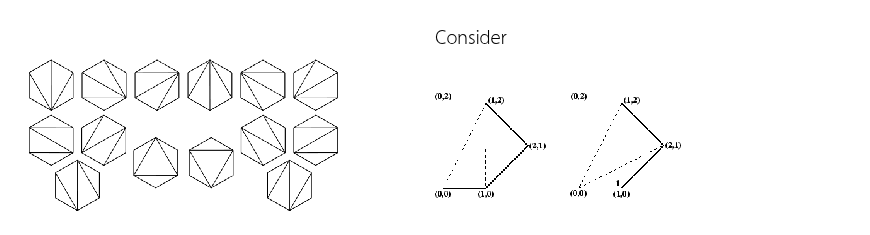

# 06 Dynamic programming

Dynamic ProgrammingA triangulation of a convex polygon is formed by drawing diagonals between non-adjacent vertices(corners) such that the diagonals never intersect. The problem is to find the cost of triangulationwith the minimum cost. The cost of a triangulation is the sum of the weights of its componenttriangles. The weight of each triangle is its perimeter (sum of lengths of all sides)

Two triangulations of the same convex pentagon. The triangulation on the left has a cost of $8 + 2\sqrt{2}+ 2\sqrt{5}$ (approximately $15.30$), and the one on the right has a cost of $4 + 2\sqrt{2} + 4\sqrt{5}$ (approximately $15.77$).

## Example of the program:

- Input:
  `{0, 0}, {1, 0}, {2, 1}, {1, 2}, {0, 2}`
- Output:
  `15.3006`

**Student must**

1. Identify the recurrence relation of this problem
2. Use the dynamic programming approach to solve the given test cases.

**Student may**

1. Visualize the result of this problem
2. Generate all cases by brute force

## สมการเวียนเกิด

$$
\begin{align*}
    dp(i, j) = \begin{cases}
        0 & \text{if } j \leq i + 1 \\
        \min_{i < k < j} (dp(i, k) + dp(k, j) + cost(i, j, k)) & \text{otherwise}
    \end{cases}
\end{align*}
$$

โดยที่ $cost(i, j, k)$ คือ ค่าระยะทางรอบรูปสามเหลี่ยมที่เกิดจากจุด $i, j, k$
